```ascii
╔═══════════════════════════════════════════════════════════════════════════════════════════════════╗
║  ████████╗██╗  ██╗███████╗    ███████╗██╗   ██╗███████╗████████╗███████╗███╗   ███╗               ║
║  ╚══██╔══╝██║  ██║██╔════╝    ██╔════╝╚██╗ ██╔╝██╔════╝╚══██╔══╝██╔════╝████╗ ████║               ║
║     ██║   ███████║█████╗      ███████╗ ╚████╔╝ ███████╗   ██║   █████╗  ██╔████╔██║               ║
║     ██║   ██╔══██║██╔══╝      ╚════██║  ╚██╔╝  ╚════██║   ██║   ██╔══╝  ██║╚██╔╝██║               ║
║     ██║   ██║  ██║███████╗    ███████║   ██║   ███████║   ██║   ███████╗██║ ╚═╝ ██║               ║
║     ╚═╝   ╚═╝  ╚═╝╚══════╝    ╚══════╝   ╚═╝   ╚══════╝   ╚═╝   ╚══════╝╚═╝     ╚═╝               ║
║                                                                                                     ║
║                         🏗️ AWANTHA IMESH - SYSTEM ARCHITECT 🏗️                                   ║
║                     Designing Tomorrow's Software Infrastructure                                    ║
╚═══════════════════════════════════════════════════════════════════════════════════════════════════╝
```

<div align="center">
  
</div>

---

## 🔧 **SYSTEM ARCHITECTURE**

<table>
<tr>
<td valign="top" width="50%">

### 🖥️ **RUNTIME ENVIRONMENT**
```yaml
engineer:
  name: "Awantha Imesh"
  location: "Sri Lanka 🇱🇰"
  role: "Software Engineer"
  status: "Optimizing Performance"
  
current_stack:
  primary: "Java Ecosystem"
  secondary: ["Frontend", "Mobile"]
  learning: "Advanced Java Patterns"
  
architecture:
  design_patterns: "Clean Architecture"
  principles: ["SOLID", "DRY", "KISS"]
  mindset: "Problem Solver"
```

### 📊 **PERFORMANCE METRICS**
```javascript
const metrics = {
  problemsSolved: 500+,
  coffeeCupsPerDay: 4,
  debugging: "Expert Level",
  codeQuality: "Production Ready",
  collaboration: "Team Player"
};
```

</td>
<td valign="top" width="50%">

### 🛠️ **TECHNOLOGY STACK**

```python
class TechStack:
    def __init__(self):
        self.languages = {
            "primary": ["Java", "JavaScript"],
            "system": ["C", "C++"],
            "web": ["PHP", "HTML5", "CSS3"],
            "proficiency": "Advanced"
        }
        
        self.frameworks = {
            "mobile": ["Flutter", "React Native"],
            "backend": ["Spring Boot", "Node.js"],
            "status": "Production Ready"
        }
        
        self.databases = ["MySQL", "PostgreSQL"]
        self.tools = ["Git", "Docker", "Jenkins"]
        
    def get_expertise_level(self):
        return "Senior Developer"
```

### 🎯 **CURRENT OBJECTIVES**
- 🔬 **R&D**: Advanced Java Design Patterns
- 🤝 **Collaboration**: Open Source Java Projects
- 📚 **Knowledge Sharing**: [Technical Blog](https://opencourseblog.blogspot.com/)
- 🏗️ **Architecture**: Scalable System Design

</td>
</tr>
</table>

---

## 📈 **SYSTEM ANALYTICS**

<div align="center">
  
  
</div>

<div align="center">
  
</div>

---

## 🏆 **ACHIEVEMENT REGISTRY**

<div align="center">
  
</div>

---

## 📊 **CONTRIBUTION MATRIX**

<div align="center">
  
</div>

---

## 🌐 **NETWORK CONNECTIONS**

```mermaid
graph LR
    A[👨‍💻 Awantha] --> B[💼 LinkedIn]
    A --> C[📺 YouTube]
    A --> D[📧 Email]
    A --> E[📝 Blog]
    
    B --> F[Professional Network]
    C --> G[Tech Content]
    D --> H[Direct Communication]
    E --> I[Knowledge Sharing]
    
    style A fill:#1f6feb,stroke:#58a6ff,color:#fff
    style B fill:#0077b5,stroke:#004182,color:#fff
    style C fill:#ff0000,stroke:#cc0000,color:#fff
    style D fill:#d14836,stroke:#a23428,color:#fff
    style E fill:#ff5722,stroke:#cc441c,color:#fff
```

<div align="center">
  


</div>

<div align="center">
  <table>
    <tr>
      <td>
        <a href="https://linkedin.com/in/awantha-imesh-473077220/">
          
        </a>
      </td>
      <td>
        <a href="https://www.youtube.com/channel/UCQ39P9TV7mr745YW3vLNmXg">
          
        </a>
      </td>
      <td>
        <a href="mailto:awanthaimesh123@gmail.com">
          
        </a>
      </td>
      <td>
        <a href="https://opencourseblog.blogspot.com/">
          
        </a>
      </td>
    </tr>
  </table>
</div>

---

## 🔬 **SYSTEM SPECIFICATIONS**

<details>
<summary><b>🔍 Click to view detailed technical specifications</b></summary>

### **Core Architecture**
```
├── 🖥️ Frontend Systems
│   ├── React Native (Mobile-First)
│   ├── Flutter (Cross-Platform)
│   └── Vanilla JS (Performance Critical)
│
├── ⚙️ Backend Infrastructure  
│   ├── Java (Enterprise Grade)
│   ├── PHP (Web Services)
│   └── Node.js (Microservices)
│
├── 🗄️ Data Layer
│   ├── MySQL (Relational)
│   ├── PostgreSQL (Advanced Features)
│   └── Redis (Caching)
│
└── 🔧 DevOps Pipeline
    ├── Git (Version Control)
    ├── Docker (Containerization)
    └── CI/CD (Automated Deployment)
```

### **Development Philosophy**
- **Clean Code**: Readable, maintainable, testable
- **Agile Methodology**: Iterative development approach
- **Test-Driven Development**: Quality assurance first
- **Performance Optimization**: Scalable solutions
- **Continuous Learning**: Staying updated with tech trends

</details>

---

## 📡 **SYSTEM STATUS**

<div align="center">
  
  
  
  
</div>

---

<div align="center">

```
╔══════════════════════════════════════════════════════════════════════════════════════════════════╗
║                                                                                                    ║
║    "First, solve the problem. Then, write the code." - John Johnson                               ║
║                                                                                                    ║
║    🚀 Building the future, one commit at a time                                                   ║
║                                                                                                    ║
╚══════════════════════════════════════════════════════════════════════════════════════════════════╝
```

</div>

<div align="center">
  
</div>

---

<div align="center">
  <sub>⚡ <strong>Powered by curiosity, driven by code, fueled by coffee</strong> ⚡</sub>
</div>
